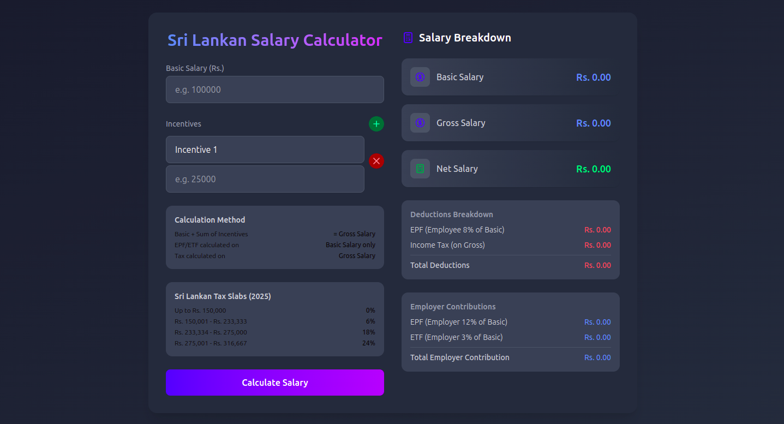

# Sri Lankan Salary Calculator
A modern, user-friendly web application for calculating salaries based on Sri Lankan tax regulations as of April 2025. This tool helps employees understand their salary breakdown, including EPF/ETF contributions and income tax deductions.


## 🚀 Live Demo
Check out the live version here: https://smart-salary-calculator.netlify.app/

## Features
* **Basic Salary & Multiple Incentives**: Add, edit, and remove multiple incentive fields with custom labels
* **Sri Lankan Tax Calculation**: Automatically calculates taxes based on 2025 tax slabs
* **EPF/ETF Calculation**: Calculates EPF (8% employee, 12% employer) and ETF (3%) contributions
* **Detailed Breakdown**: Shows comprehensive breakdown of gross salary, net salary, and all deductions
* **Responsive Design**: Works seamlessly on desktop and mobile devices
* **Dark Mode Support**: Optimized for both light and dark themes

## Calculation Method
* Basic Salary + Sum of Incentives = Gross Salary
* EPF/ETF calculated on Basic Salary only
* Income Tax calculated on Gross Salary
* Net Salary = Gross Salary - EPF (employee) - Income Tax
* Tax Slabs (Sri Lanka 2025)
    * Up to Rs. 150,000               0%
    * Rs. 150,001 - Rs. 233,333       6%
    * Rs. 233,334 - Rs. 275,000       18%
    * Rs. 275,001 - Rs. 316,667       24%

## Technologies Used
* **React**: Frontend library for building the user interface
* **Formik & Yup**: Form handling and validation
* **Framer Motion**: Animations and transitions
* **React Toastify**: Toast notifications
* **Tailwind CSS**: Utility-first CSS framework for styling

## Installation and Setup
1. Clone the repository:
```bash
`git clone https://github.com/NelushGayashan/salary-calculator.git 
cd sri-lankan-salary-calculator`
```

2. Install dependencies:
```bash
`npm install`
```

3. Start the development server:
```bash
`npm start`
```

4. Open your browser and navigate to:
```bash
`http://localhost:5173`
```

## Usage
1. Enter your Basic Salary in the first field
2. Add incentives by clicking the "+" button (optional)
3. For each incentive, provide a label (e.g., "Bonus", "Allowance") and amount
4. Click "Calculate Salary" to see your detailed salary breakdown
5. View the results in the right panel, including:
    * Basic Salary
    * Individual Incentives
    * Gross Salary
    * Net Salary
    * Deductions (EPF, Income Tax)
    * Employer Contributions

## Contributing
Contributions are welcome! Please feel free to submit a Pull Request.
1. Fork the repository
2. Create your feature branch (`git checkout -b feature/amazing-feature`)
3. Commit your changes (`git commit -m 'Add some amazing feature'`)
4. Push to the branch (`git push origin feature/amazing-feature`)
5. Open a Pull Request

## License
This project is licensed under the MIT License - see the LICENSE file for details.

## Acknowledgements
* Sri Lankan Department of Inland Revenue for tax information
* Formik for form handling
* Tailwind CSS for styling
* Framer Motion for animations
  Created with ❤️ by Nelush Gayashan
